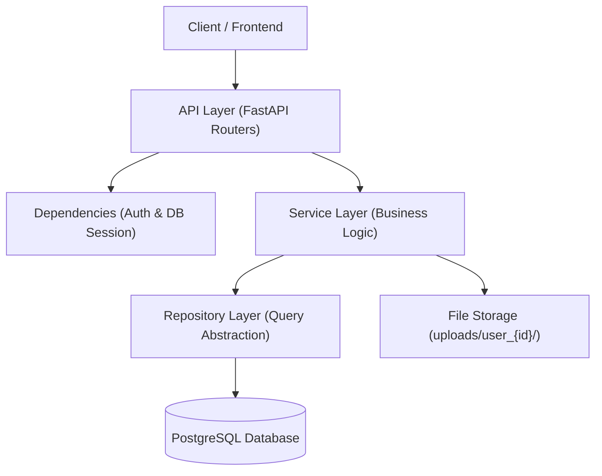
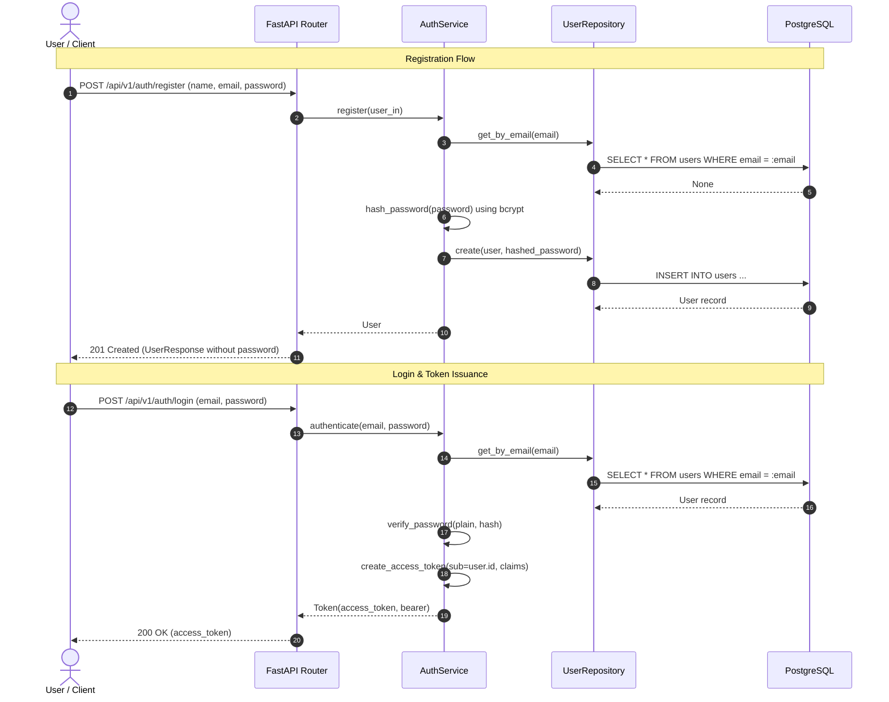
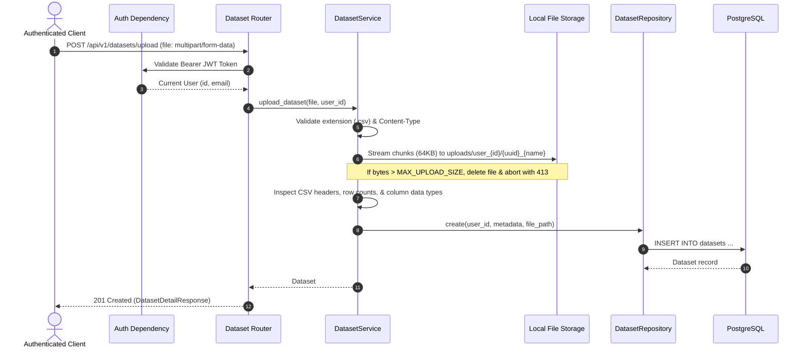

# InfoLoom Phase 1 Architecture: Authentication & Dataset Management

## Overview
Phase 1 establishes the core backend foundations for InfoLoom: secure multi-tenant user authentication and streaming dataset upload and management.

---

## Layered Clean Architecture

### Layer Responsibilities
- **API (`app/api/`)**: Defines endpoints, routes, query/body parameter validation, and HTTP status codes.
- **Dependencies (`app/api/dependencies.py`)**: Handles per-request database session management (`get_db`) and JWT token extraction/validation (`get_current_user`).
- **Services (`app/services/`)**: Implements business rules: password hashing, JWT generation, file streaming, MIME/extension verification, CSV parsing, metadata extraction, and multi-tenant access control.
- **Repositories (`app/repositories/`)**: Encapsulates all SQLAlchemy queries (`select`, `add`, `delete`, filtering by `user_id`).
- **Models (`app/models/`)**: SQLAlchemy declarative models (`User`, `Dataset`) mapping to database tables.
- **Schemas (`app/schemas/`)**: Pydantic models for data validation, serialization, and OpenAPI documentation.
- **Core (`app/core/`)**: Application configurations (`Settings`) and security utilities (`hash_password`, `verify_password`, `create_access_token`).

---

## Authentication Flow

---

## Dataset Ingestion & Streaming Flow

---

## Multi-Tenancy & Security Guarantees
1. **Strict Ownership Isolation**: Every query in `DatasetRepository` filters by `user_id == current_user.id`. Even if a user knows another user's dataset ID, requests return `404 Not Found`.
2. **Path Traversal Protection**: Filenames are sanitized via `os.path.basename` and regex alphanumeric scrubbing before writing to disk.
3. **RAM Exhaustion (DoS) Protection**: Uploads are processed in 64KB streaming chunks rather than loaded into memory all at once.
4. **Cascading Deletions**: Deleting a user cascades to all their datasets via `ondelete='CASCADE'`.
