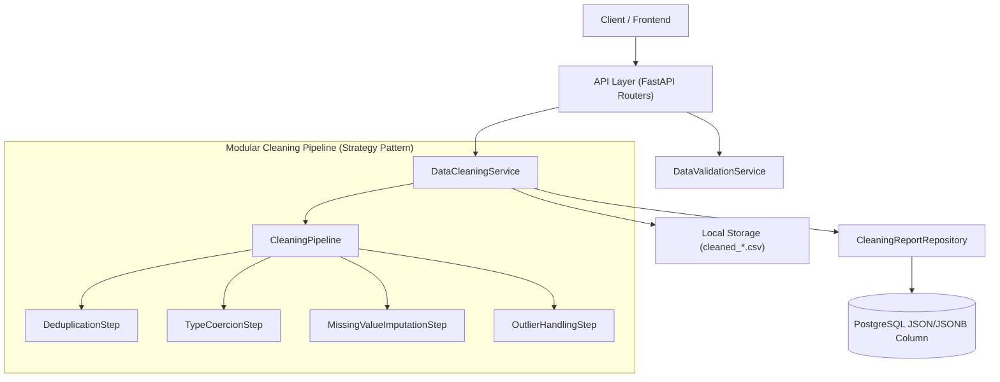

# InfoLoom Phase 2 Architecture: Data Validation & Automatic Cleaning

## Overview
Phase 2 implements the automated data quality validation engine, modular data cleaning pipeline using the Strategy pattern, and transparent audit logging via persisted cleaning reports.

---

## Architecture & Strategy Pattern

---

## 1. Data Validation Engine (`DataValidationService`)
Analyzes raw datasets across multiple dimensions without mutating data:
1. **Schema & Semantic Data Type Detection**:
   - Identifies integer, float, boolean, datetime, and categorical columns.
   - Computes unique counts and cardinality ratios.
2. **Missing-Value Profiling & Mechanism Categorization**:
   - Tracks total missing cells, percentage missing per column, and rows with any missing values.
   - Categorizes missingness severity: `none` (0%), `low` (<5%, MCAR candidate), `moderate` (5-20%, MAR candidate), `severe` (>20%, drop or model-based).
3. **Duplicate Detection**:
   - Counts exact duplicate rows and overall duplicate percentage.
4. **Outlier Detection**:
   - **IQR Method**: $Q_1 - 1.5 \times \text{IQR}$ to $Q_3 + 1.5 \times \text{IQR}$.
   - **Z-Score Method**: $|z| > 3.0$ where $z = \frac{x - \mu}{\sigma}$.
   - Records outlier counts, percentages, and calculated lower/upper bounds.

---

## 2. Modular Cleaning Pipeline (`CleaningPipeline`)
Implements the **Strategy Design Pattern** where each transformation step inherits from `CleaningStep`:

| Step Strategy | Class | Responsibilities | Configurable Parameters |
|---|---|---|---|
| **Deduplication** | `DeduplicationStep` | Drops duplicate rows, preserving data integrity | `keep`: `'first'`, `'last'`, or `False` |
| **Type Coercion** | `TypeCoercionStep` | Trims string whitespace, converts currency/percentages/commas to numbers, coerces boolean strings and datetimes | Automatic heuristic matching |
| **Missing Imputation** | `MissingValueImputationStep` | Imputes missing values based on statistical distributions or drops severe columns | `numeric_strategy`: `'median'` (default, robust to skewness), `'mean'`, `'mode'`, `'constant'`, `'drop'`. `categorical_strategy`: `'mode'`, `'constant'`, `'drop'`. `drop_column_threshold` |
| **Outlier Handling** | `OutlierHandlingStep` | Handles extreme values without silent data distortion | `strategy`: `'none'` (flag only), `'clip'` (winsorize to boundary), `'remove'` (drop rows). `method`: `'iqr'` or `'zscore'` |

---

## 3. Transparency & Persisted Cleaning Reports
Every execution of the cleaning pipeline produces an audit report persisted in the `cleaning_reports` table:
- **`validation_summary`**: Statistical snapshot of the dataset before cleaning.
- **`cleaning_summary`**: Transformations performed, rows/columns removed, values imputed per column, and bounds clipped.
- **`cleaned_file_path`**: Storage location of the resulting cleaned CSV file.
