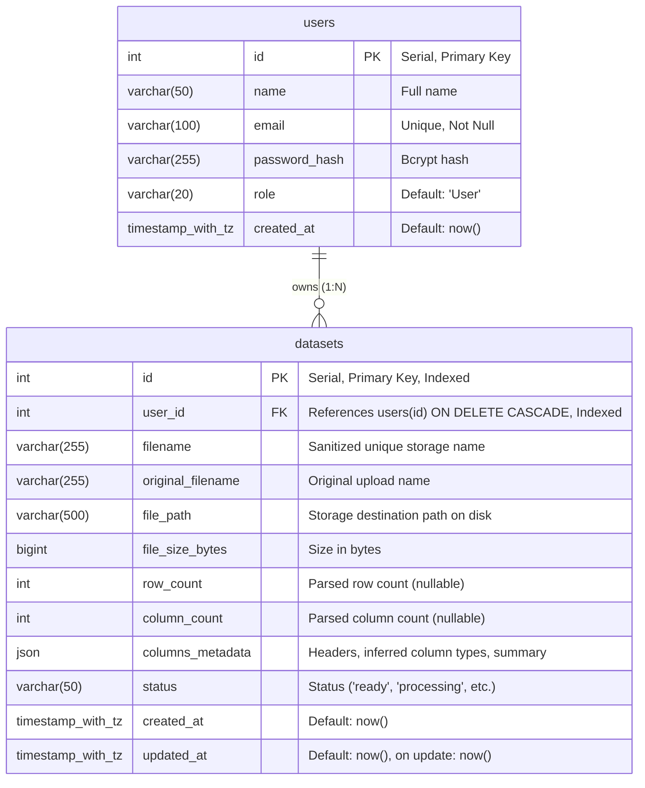

# InfoLoom Phase 1 Database Schema

## Entity Relationship Diagram

## Tables & Constraints

### 1. `users` Table
| Column | Type | Constraints | Description |
|---|---|---|---|
| `id` | `INTEGER` | Primary Key, Autoincrement | Unique identifier |
| `name` | `VARCHAR(50)` | NOT NULL | User's full name |
| `email` | `VARCHAR(100)` | NOT NULL, UNIQUE | User's unique login email |
| `password_hash` | `VARCHAR(255)` | NOT NULL | Bcrypt hashed password |
| `role` | `VARCHAR(20)` | NOT NULL, Default: `'User'` | Role / access level |
| `created_at` | `TIMESTAMPTZ` | NOT NULL, Default: `now()` | Record creation timestamp |

### 2. `datasets` Table
| Column | Type | Constraints | Description |
|---|---|---|---|
| `id` | `INTEGER` | Primary Key, Indexed | Unique dataset identifier |
| `user_id` | `INTEGER` | NOT NULL, Indexed, Foreign Key -> `users.id` (ON DELETE CASCADE) | Owner multi-tenant foreign key |
| `filename` | `VARCHAR(255)` | NOT NULL | Local filesystem stored file name |
| `original_filename` | `VARCHAR(255)` | NOT NULL | User's uploaded file name |
| `file_path` | `VARCHAR(500)` | NOT NULL | Path on disk to the stored CSV file |
| `file_size_bytes` | `BIGINT` | NOT NULL | Exact byte count |
| `row_count` | `INTEGER` | NULLABLE | Total number of data rows |
| `column_count` | `INTEGER` | NULLABLE | Total number of columns |
| `columns_metadata` | `JSON` | NULLABLE | Column names and inferred data types |
| `status` | `VARCHAR(50)` | NOT NULL, Default: `'ready'` | Dataset processing status |
| `created_at` | `TIMESTAMPTZ` | NOT NULL, Default: `now()` | Creation timestamp |
| `updated_at` | `TIMESTAMPTZ` | NOT NULL, Default: `now()` | Last modification timestamp |

### Foreign Keys & Cascading
- `datasets.user_id` -> `users.id` with `ON DELETE CASCADE`. If a user account is deleted, all associated dataset records are automatically deleted by the database engine.
