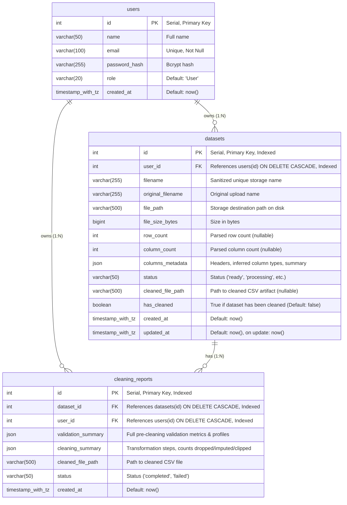

# InfoLoom Phase 2 Database Schema

## Entity Relationship Diagram

## Schema Changes in Phase 2
1. **New Table: `cleaning_reports`**:
   - `id`: Primary key
   - `dataset_id`: Foreign key -> `datasets.id` with `ON DELETE CASCADE`
   - `user_id`: Foreign key -> `users.id` with `ON DELETE CASCADE` (strict multi-tenant ownership)
   - `validation_summary`: JSON storing comprehensive descriptive stats, missingness, duplicates, and outliers
   - `cleaning_summary`: JSON storing audit trail of actions taken per strategy
   - `cleaned_file_path`: Storage location of cleaned artifact
   - `status`: Execution status
   - `created_at`: Audit timestamp
2. **Additions to `datasets` table**:
   - `cleaned_file_path` (`VARCHAR(500)`, nullable)
   - `has_cleaned` (`BOOLEAN`, NOT NULL, default `false`)
